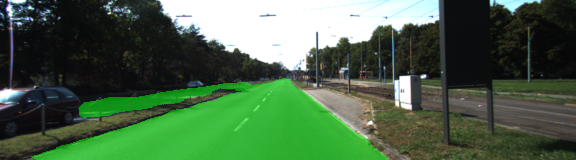
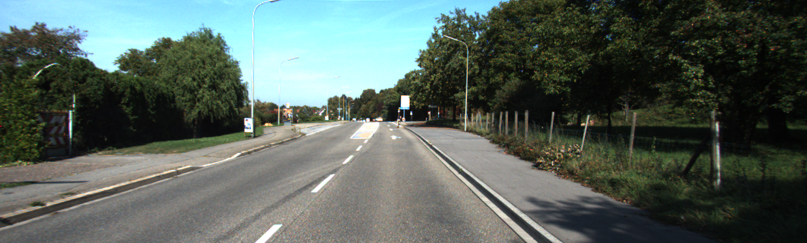

# Semantic Segmentation

## Introduction
The aim of this project is to understand the concept of FCN (Fully Convolutional Neural Network) that is one of the basic Semantic Segmentation algorithms.

### Program
The program in this project uses the VGG-16 for image feature extraction to perform semantic segmentation to identify drivable road area from images.

### Dataset and pre-trained VGG16 model

The program uses frozen VGG16 model provided [here](https://s3-us-west-1.amazonaws.com/udacity-selfdrivingcar/vgg.zip) from udacity.

Then the program trains its network with [Kitti Road dataset](http://www.cvlibs.net/datasets/kitti/eval_road.php) that consists of 289 training and 290 test images. 

It contains three different categories of road scenes:

- uu - urban unmarked (98/100)
- um - urban marked (95/96)
- umm - urban multiple marked lanes (96/94)

### Result
Following images are some sample sets of original images and output images infered by the FCN.








All infered images are shown as three videos as follows.


<!--
### Setup

This project was confirmed to run with python 3.5.4, tensorflow 1.5.0 and cuda-9.0 on Ubuntu 16.04 LTS.

```
sudo apt-get remove nvidia-*
wget http://us.download.nvidia.com/XFree86/Linux-x86_64/375.66/NVIDIA-Linux-x86_64-375.66.run
sudo bash ./NVIDIA-Linux-x86_64-375.66.run  --dkms

git clone https://github.com/yyuu/pyenv.git ~/.pyenv
echo 'export PYENV_ROOT="${HOME}/.pyenv"' >> ~/.bashrc
echo 'if [ -d "${PYENV_ROOT}" ]; then' >> ~/.bashrc
echo 'export PATH=${PYENV_ROOT}/bin:$PATH' >> ~/.bashrc
echo 'eval "$(pyenv init -)"' >> ~/.bashrc
echo 'fi' >> ~/.bashrc
source ~/.bashrc

pyenv install 3.5.4
~/.pyenv/versions/3.5.4/bin/pip3 install tensorflow-gpu=1.5.0 numpy scipy tqdm Pillow

install cuda-9.0
```
-->


## Rubric Points

### Build the Neural Network

#### Does the project load the pretrained vgg model?
This project loads the pre-trained VGG model at load_vgg().

#### Does the project learn the correct features from the images?
This project defines layers fot the FCN method at layers().

#### Does the project optimize the neural network?
This project defines its loss function and optimizer at optimize().

#### Does the project train the neural network?
This project trains correctly the network at train_nn().

### Neural Network Training

#### Does the project train the model correctly?
The model decreases loss over time on average as below.


#### Does the project use reasonable hyperparameters?

- batch_size = 20
- other hyperparameters are same as Tensorflow initial values.
  - learning_rate = 0.001
- epoch number = 1000 (loss < 0.01)
  - approximately 100 times to train til the loss value becomes to be less than the threshold.

The batch size 20 is the value that shows the most smooth training-curve in some trial as below.


#### Does the project correctly label the road?

The project works correctly, and labels the road as mentioned above.

The most of the result images are labeled at least 80% of the road and labeled no more than 20% of non-road pixels as road.


# The following is the original README provided by Udacity

### Introduction
In this project, you'll label the pixels of a road in images using a Fully Convolutional Network (FCN).

### Setup
##### Frameworks and Packages
Make sure you have the following is installed:
 - [Python 3](https://www.python.org/)
 - [TensorFlow](https://www.tensorflow.org/)
 - [NumPy](http://www.numpy.org/)
 - [SciPy](https://www.scipy.org/)
##### Dataset
Download the [Kitti Road dataset](http://www.cvlibs.net/datasets/kitti/eval_road.php) from [here](http://www.cvlibs.net/download.php?file=data_road.zip).  Extract the dataset in the `data` folder.  This will create the folder `data_road` with all the training a test images.

### Start
##### Implement
Implement the code in the `main.py` module indicated by the "TODO" comments.
The comments indicated with "OPTIONAL" tag are not required to complete.
##### Run
Run the following command to run the project:
```
python main.py
```
**Note** If running this in Jupyter Notebook system messages, such as those regarding test status, may appear in the terminal rather than the notebook.

### Submission
1. Ensure you've passed all the unit tests.
2. Ensure you pass all points on [the rubric](https://review.udacity.com/#!/rubrics/989/view).
3. Submit the following in a zip file.
 - `helper.py`
 - `main.py`
 - `project_tests.py`
 - Newest inference images from `runs` folder  (**all images from the most recent run**)
 
 ### Tips
- The link for the frozen `VGG16` model is hardcoded into `helper.py`.  The model can be found [here](https://s3-us-west-1.amazonaws.com/udacity-selfdrivingcar/vgg.zip)
- The model is not vanilla `VGG16`, but a fully convolutional version, which already contains the 1x1 convolutions to replace the fully connected layers. Please see this [forum post](https://discussions.udacity.com/t/here-is-some-advice-and-clarifications-about-the-semantic-segmentation-project/403100/8?u=subodh.malgonde) for more information.  A summary of additional points, follow. 
- The original FCN-8s was trained in stages. The authors later uploaded a version that was trained all at once to their GitHub repo.  The version in the GitHub repo has one important difference: The outputs of pooling layers 3 and 4 are scaled before they are fed into the 1x1 convolutions.  As a result, some students have found that the model learns much better with the scaling layers included. The model may not converge substantially faster, but may reach a higher IoU and accuracy. 
- When adding l2-regularization, setting a regularizer in the arguments of the `tf.layers` is not enough. Regularization loss terms must be manually added to your loss function. otherwise regularization is not implemented.
 
### Using GitHub and Creating Effective READMEs
If you are unfamiliar with GitHub , Udacity has a brief [GitHub tutorial](http://blog.udacity.com/2015/06/a-beginners-git-github-tutorial.html) to get you started. Udacity also provides a more detailed free [course on git and GitHub](https://www.udacity.com/course/how-to-use-git-and-github--ud775).

To learn about REAMDE files and Markdown, Udacity provides a free [course on READMEs](https://www.udacity.com/courses/ud777), as well. 

GitHub also provides a [tutorial](https://guides.github.com/features/mastering-markdown/) about creating Markdown files.
